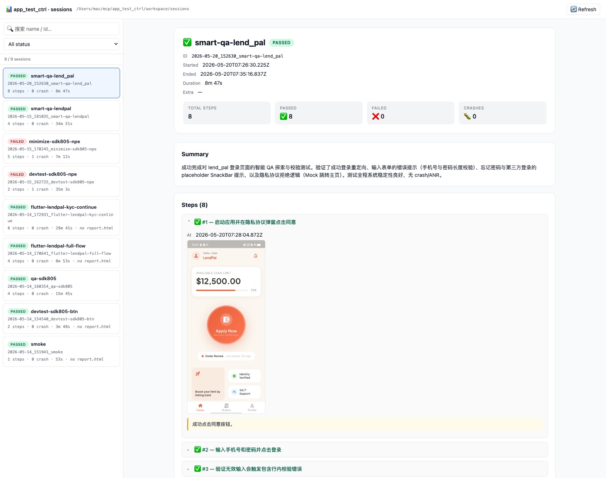
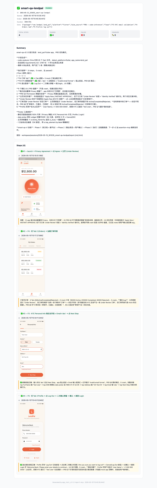

# app_test_ctrl

[](./LICENSE)
[](https://nodejs.org/)

AI 驱动的移动 App 自动化测试平台（MCP-native）。

让 **任意 MCP-aware AI 编程客户端**（Claude Code / Cursor / Claude Desktop / Codex CLI / opencode…）在你的 Android / iOS Simulator/真机 上：
- **DevTest**：读 `git diff` → 推断改了哪个页面 → 跑一遍 → 出报告（"我刚改的登录能用吗"）
- **QA**：自由探索 → 用状态图避免死循环 → 抓 crash → 出 bug 列表
- **Minimize**：12 步触发的崩溃 → 用 delta-debug 压成 3 步并验证
- **Smart-QA**：一句 "帮我看下有没有 bug" → 读 PRD / 静态推断业务流 → 自动跑 + 比对预期

通过 **5 个 MCP**（log + report + ui + analyzer + code-analyzer）+ **4 个 Skill**（devtest / qa / minimize / smart-qa）+ 上游 mobile-mcp 组合实现。MCP 协议本身跨客户端通用，4 个 Skill 文件 ~95% 中立（核心是 MCP tool 调用 + 自然语言指令）。

- **方案与决策**：[PLAN.md](./PLAN.md)
- **实施进度**：[PROGRESS.md](./PROGRESS.md)
- **🤖 让 AI 帮你装**：[docs/INSTALL_FOR_AI.md](./docs/INSTALL_FOR_AI.md)（整段粘进你的 AI 聊天框，AI 接力跑完安装）
- **安装与接入**：[docs/SETUP.md](./docs/SETUP.md)
- **跨客户端支持**：[docs/CLIENTS.md](./docs/CLIENTS.md)（Claude Code / Cursor / Claude Desktop / Codex CLI / opencode）
- **架构总览**：[docs/ARCHITECTURE.md](./docs/ARCHITECTURE.md)

## 组件

| 路径 | 角色 | 状态 |
|---|---|---|
| `mcp-servers/log-mcp/` | Android logcat / ANR / tombstone + iOS log stream / .ips | 14 工具 |
| `mcp-servers/report-mcp/` | Session + Markdown/HTML 报告 + QA 状态图 | 12 工具 |
| `mcp-servers/ui-mcp/` | uiautomator 层级查询 + 智能点击（Android） | 7 工具 |
| `mcp-servers/analyzer-mcp/` | crash signature / dedup / 路径精简 / .ips 解析 | 6 工具 |
| `mcp-servers/code-analyzer-mcp/` | 静态扫码：平台识别 + PRD 发现 + 页面/路由/API 抽取 | 4 工具 |
| `skills/devtest/` | 开发自测 Agent（git diff → 验证） | Skill 源 |
| `skills/qa/` | QA 自动探索 Agent（状态图 + dedup） | Skill 源 |
| `skills/minimize/` | 复现路径精简（delta-debug + replay） | Skill 源 |
| `skills/smart-qa/` | 一句话 → 自动跑业务流（PRD + 静态推断） | Skill 源 |

`mobile-mcp` 直接使用上游 `@mobilenext/mobile-mcp`。

### Agent Skills 介绍

- **devtest (开发自测)**：
  - **场景**：“我刚改的登录能跑通吗？”
  - **流程**：读取 `git diff` 识别修改的文件 -> 静态分析受影响的 UI 页面 -> 自动生成 Happy Path 和 Edge Case 测试计划 -> 执行测试（截图+防崩溃监控） -> 生成测试报告。
- **qa (自动探索测试)**：
  - **场景**：“自由探索一下这个 app，看看有没有崩的地方。”
  - **流程**：冷启动 App -> 自动获取页面元素并依据状态图策略（优先点击未探索元素）进行深度探索 -> 遇到崩溃自动记录、重启并继续探索 -> 探索结束后对 Crash 进行去重分析。
- **minimize (复现路径精简)**：
  - **场景**：“这个崩溃步骤有 12 步，帮我精简一下。”
  - **流程**：基于 Delta-Debugging (ddmin) 二分算法，通过自动重启 App 并 Replay 部分步骤组合，找到复现该崩溃特征指纹的最短路径（例如将 12 步压缩至 3 步）。
- **smart-qa (智能需求对齐测试)**：
  - **场景**：“对照 PRD 帮我看看这个项目有没有 bug。”
  - **流程**：通过 `code-analyzer` 静态推断业务流并读取 PRD -> 列出测试流供用户确认 -> 执行测试并比对实际 UI 表现与 PRD 预期是否一致（如邮箱格式未校验、功能未实现等）。
- **测试报告与可视化看板**：
  - **结果呈现**：每次自测或自动探索完成后，不仅会保存步骤截图与崩溃日志，还会自动生成单文件交互式的 HTML 报告。
  - **本地看板网页**：通过在终端执行 `npm run sessions`，会启动一个本地网页服务（默认 `http://localhost:7321`），您可以在浏览器里极佳地查阅、过滤和对比所有历史测试 session 的执行结果和截图。

## 快速开始

**🤖 懒人路径**：直接把下面整段粘进你的 AI 聊天框（Claude Code / Cursor / Codex / Claude Desktop 都可以），说"按这个指引帮我装好 app-test-ctrl"，AI 会一步步带你跑完。

```
帮我根据https://github.com/dj931567261/app-test-control/blob/main/docs/INSTALL_FOR_AI.md 文档安装app-test-ctrl
```

**手动路径**：

```bash
npm install
npm run build
npm run prewarm                                # 预拉 mobile-mcp 到 npx 缓存（避免首次启动卡）
```

然后按你的客户端选一条分支（详见 [docs/CLIENTS.md](./docs/CLIENTS.md)）：

```bash
# Claude Code（默认）
npm run setup                                  # 写 .mcp.json
# .claude/skills/ 已随仓库分发，开箱即用

# Cursor
npm run setup -- --client cursor               # 写 .cursor/mcp.json
npm run install:skills -- --client cursor      # 写 .cursor/rules/*.mdc

# Codex CLI
npm run setup -- --client codex                # 打印 TOML 片段 → 粘到 ~/.codex/config.toml
npm run install:skills -- --client codex       # 复制到 ~/.codex/skills/ + 项目根 AGENTS.md

# Claude Desktop
npm run setup -- --client claude-desktop       # 打印 JSON 片段 → 粘到全局 config
npm run install:skills -- --client claude-desktop  # 列出 skill 文件路径供手动粘贴

# opencode
npm run setup -- --client opencode             # 合并配置到全局 ~/.config/opencode/opencode.json
npm run install:skills -- --client opencode    # 安装技能（检测并复用项目内 .claude/skills/，若缺失则自动写入全局）

# 卸载清理（以 opencode 为例，支持各客户端）
npm run uninstall -- --client opencode         # 清除对应客户端的 MCP 节点和 Skill 文件

# 最后统一自检
npm run doctor                                 # 检查 Node/adb/xcrun/构建/配置/skills

# 查看历史 session（本地浏览面板）
npm run sessions                               # 默认 http://localhost:7321/
npm run sessions -- --open                     # 启动后自动打开浏览器
npm run sessions -- --port 7400 --workspace ./other/sessions
```

冒烟测试和故障排查见 [docs/SETUP.md](./docs/SETUP.md)。

## 怎么用（典型对话）

```
用户：测一下我刚改的登录功能
   ↓
Claude 触发 devtest skill：
   1. 读 git diff → 看到 LoginActivity.kt 改了
   2. 推断影响：登录页面
   3. 列测试计划：手机号正常 / 错误 / 网络异常
   4. 起 session → 抓 logcat → 启动 app
   5. ui.tap_element(identifier=btn) → 走完每一步
   6. 抓不到 crash → finalize(passed)
   ↓
✅ 登录功能测试 (8/8, 23s, 0 crash)
报告: workspace/sessions/.../report.md  +  report.html
```

```
用户：自动探索一下 jko.dns.qwn.dfgt
   ↓
Claude 触发 qa skill：
   1. dump_hierarchy → page_fingerprint → graph_record_page
   2. graph_pick_next_unseen → 挑没点过的元素
   3. tap → 重抓 → graph_record_edge
   4. 检测到 crash → record_crash + relaunch + 继续
   5. analyzer.dedup → 7 次 crash → 3 个独立 bug
   ↓
🐛 #1 NullPointerException @ LoginActivity.onClick (触发 5 次)
🐛 #2 ANR after rotation (1 次)
🐛 #3 Crash on empty payment (1 次)
报告: workspace/sessions/.../report.md
```

```
用户：帮我看下 lend_pal 有没有 bug
   ↓
Claude 触发 smart-qa skill：
   1. code-analyzer.analyze_project → 识别 Flutter + 12 页 + 22 路由
   2. 找到 requirements.md（PRD）→ 读
   3. 综合 PRD + 代码 → 列出 5 个业务流，让用户回编号（如 "1,3,5" 或 "all"）
   4. 用户选 3 条 → 走 devtest skill 逐条执行
   5. 0 crash，但发现 6 个 PRD 不一致（邮箱无校验 / Face mock / 等）
   ↓
🔎 lend_pal: 0 crash, 6 UX/PRD 不一致
报告: workspace/sessions/.../report.md
```

## 报告示例截图





> 来源：`workspace/sessions/2026-05-15_181035_smart-qa-lendpal/report.html`（smart-qa 一句话探索 lend_pal Flutter app，4 flows × 0 crash × 34m55s）

## 依赖

- Node.js ≥ 20
- npm ≥ 10
- **Android**：SDK Platform Tools（提供 `adb`）
- **iOS（Simulator）**：Xcode 命令行工具（提供 `xcrun simctl`）
- 任一 MCP-aware AI 编程客户端：Claude Code / Cursor / Claude Desktop / Codex CLI / opencode 等

## 仓库结构

```
.
├── PLAN.md / PROGRESS.md / README.md
├── .mcp.json.example         # MCP 注册样板（用 ${PROJECT_ROOT} 模板，被 setup 脚本展开）
├── config.yaml               # 设备/包名/阈值
├── docs/                     # 详细文档（含 CLIENTS.md 跨客户端指南）
├── mcp-servers/              # 五个自研 MCP（TypeScript workspace）
├── skills/                   # Skill 源文件（canonical，跨客户端通用）
├── scripts/                  # setup-mcp / install-skills / prewarm / doctor
├── test-plans/               # 用户测试用例 (markdown)
└── workspace/sessions/       # 运行时数据（每次跑一个目录）
```

## 致谢

[](https://linux.do)

感谢 **`linux.do`** 社区的讨论、分享与支持。这个项目在方法论整理、实践思路和持续迭代上，都受益于社区氛围与成员交流。

[mobile-mcp](https://github.com/mobile-next/mobile-mcp)  — 感谢mobile-mcp，就是受到这个mcp的启发才开始做的，并提供了很多思路。

## License

[MIT](./LICENSE) — 自由使用、修改、分发；保留版权与免责声明即可。
